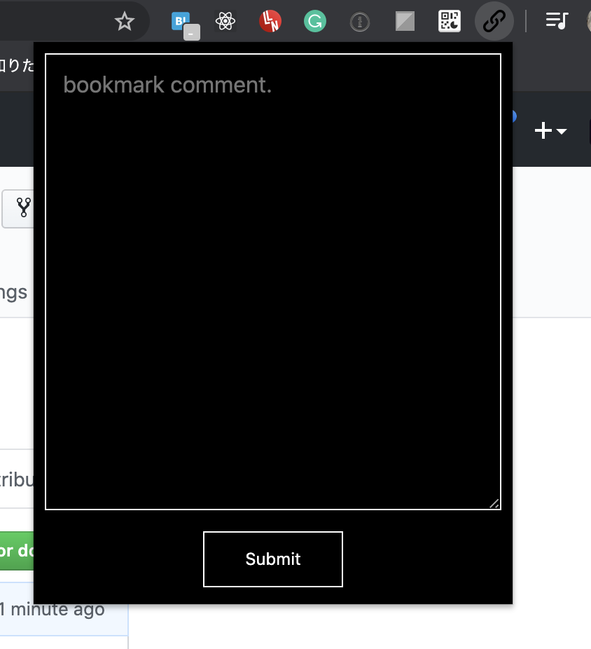

# private-bookmarker

自分専用 bookmarker chrome 拡張. Web ページのタイトル・URL とそれに対するコメントを Firestore に保存する。

テックなやつからエッチなやつまでなんでも突っ込んでも誰にもバレない。

<div align="center">
　　
</div>

## 使い方

1. firebase 作る(課金を有効化する必要あり)

2. cloud function の環境作る（下記参照）

```sh
cd functions

yarn deploy
```

3. client のビルド

```sh
yarn install

yarn webpack
```

4. client を chrome 拡張として install

FYI: https://naokixtechnology.net/javascript/2851

## dev

### client

```sh
yarn install

yarn webpack
```

### server

```sh
firebase init
```

functions

```sh
cd functions

yarn deploy
```

firestore

```sh
# firestore の rules 適用
firebase deploy --only firestore:rules
```

## memo

chrome 拡張の install 方法
https://naokixtechnology.net/javascript/2851

chrome 拡張の 作り方
https://liginc.co.jp/web/tool/browser/163575/4

form 送信
http://archive.blog.hekt.org/archives/3498/

TIPS:

一回読み込めば自動で load してくれる

## TODO

CF を外部 API から叩かせるので課金が必要になってる。

その対策として

- localhost に CF 叩くサーバー立てる
- extension から storage 直接突っ込む
- spreadsheet API に移行する

とかを考えている

## Thanks

manifest に読み込ませる素材は https://liginc.co.jp/web/tool/browser/163575/4 から拝借いたしました。
